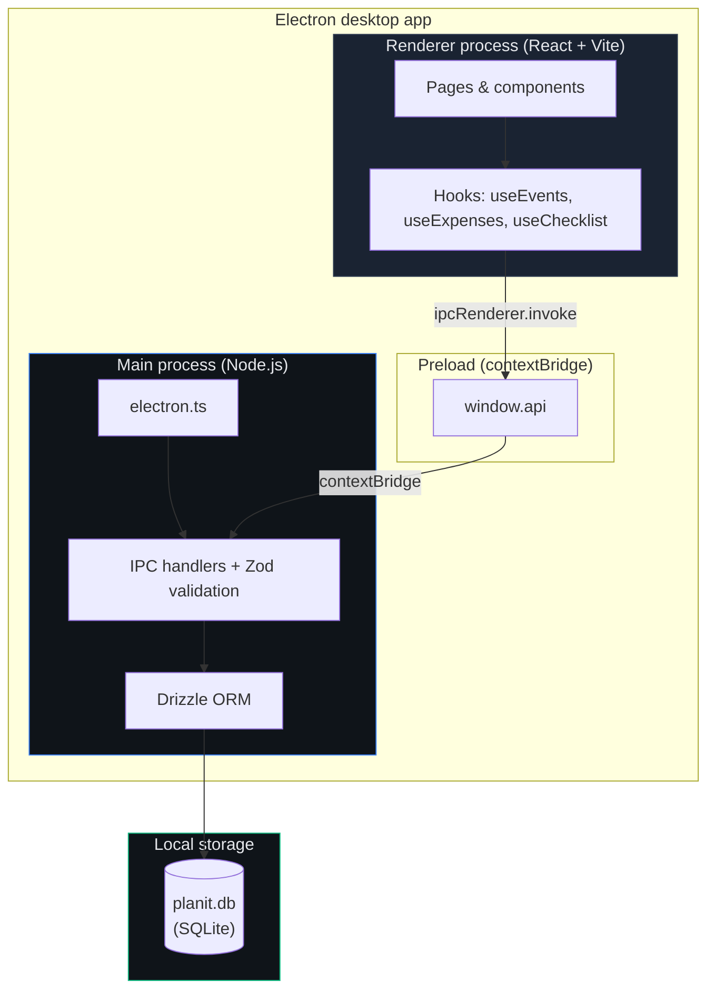
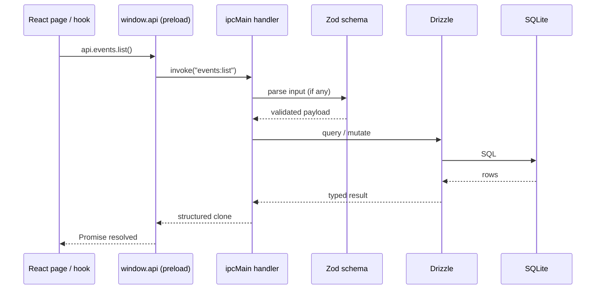
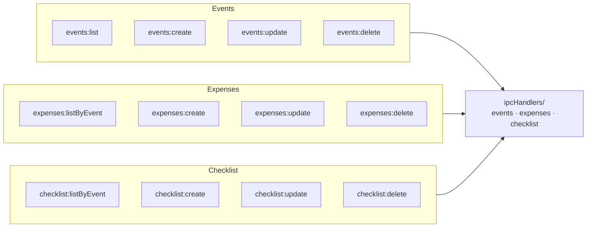
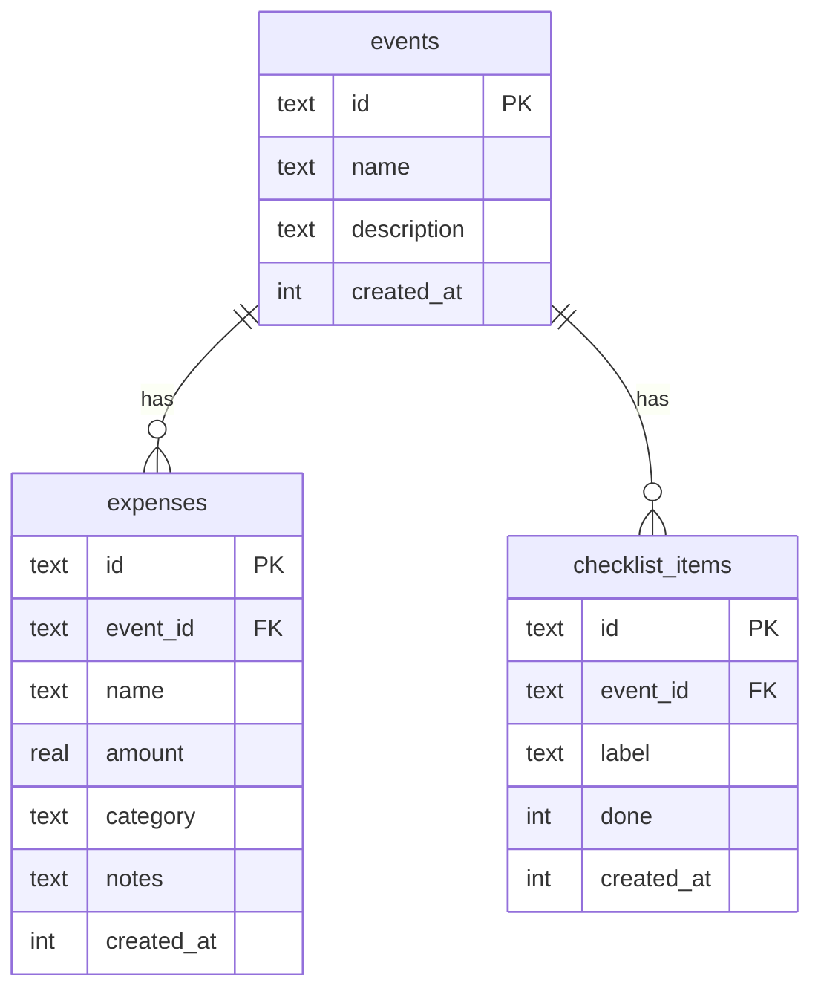
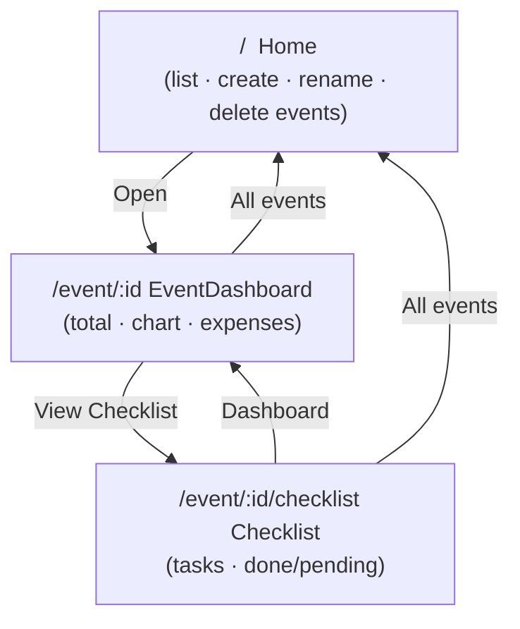
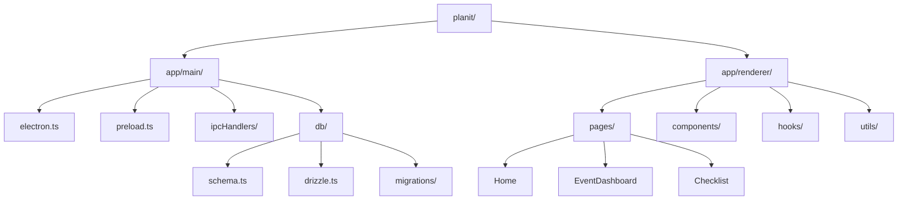
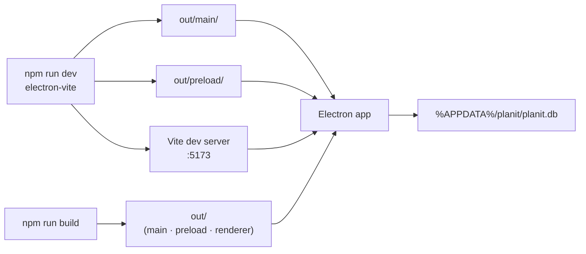

# Planit — Architecture

Desktop event budgeting app. All data stays local; the renderer never touches the filesystem or database directly.

## System overview

## Process boundaries

| Layer | Runs in | Responsibility |
|-------|---------|----------------|
| **Renderer** | Chromium (sandboxed) | UI, routing, charts, calls `window.api` only |
| **Preload** | Isolated bridge | Exposes typed `PlanitAPI` via `contextBridge` |
| **Main** | Node.js | Window lifecycle, IPC, DB access, migrations |
| **SQLite** | Disk (`userData/planit.db`) | Persistent events, expenses, checklist |

## IPC request flow

## IPC channels

Every handler validates input with **Zod** before touching the database.

## Data model

Deleting an **event** cascades to its expenses and checklist items.

## UI routing

## Repository layout

## Build & runtime

## Security model

- **contextIsolation: true** — renderer cannot access Node or `ipcRenderer` directly
- **nodeIntegration: false** — no Node APIs in the UI bundle
- **Preload-only API** — single surface (`window.api`) for all data operations
- **No network backend** — no remote API; SQLite file is local to the machine
